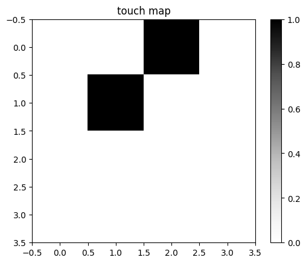
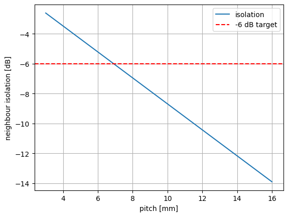
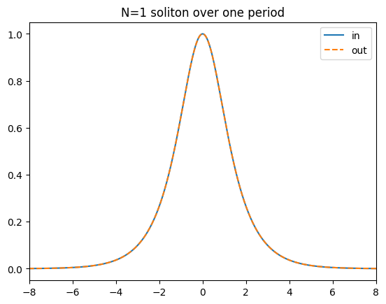

# FiberTouch 4x4

Proof-of-concept **fiber-optic infrared touch surface**. A 4x4 grid of pixels; each pixel has an 850 nm IR transmit fiber and a receive fiber. A finger scatters extra IR into the receive fiber, the Pi NoIR camera sees that receiver spot brighten, and we decide touch from the change vs. an untouched baseline. LEDs are scanned one at a time so the active transmitter is always known.

Living project - see [`docs/TEST_PLAN.md`](docs/TEST_PLAN.md) for the full verification plan.

## Results - it works

Straight from the executed notebooks (`notebooks/`):

| Live touch map | Neighbour isolation | NLSE solver vs. theory |
|:---:|:---:|:---:|
|  |  |  |
| fingers on (0,2) & (1,1) detected | clears the -6 dB crosstalk target | N=1 soliton holds shape over a full period |

More figures in [`results/`](results/): link budget vs. fiber length, GVD pulse broadening.

## Layout

```
touch_sensing.py        sensing pipeline + optical link/crosstalk model
fiber_propagation.py    split-step Fourier NLSE solver (IR pulse propagation)
test_*.py               pytest suites (SW-O*, SW-S*, SW-P*)
notebooks/              executed demo notebooks per test group
demos/                  small runnable demos of each stage (software, no hw)
rpi/                    Raspberry Pi drivers (LEDs, camera, scan loop)
hardware/               bench characterization logs (Stage 1 & 2)
docs/TEST_PLAN.md       test & verification plan
```

## Run the tests

```bash
pip install -r requirements-dev.txt
pytest -q
```

## Status

- Software suite (L1): green.
- Optical model + NLSE solver: validated against analytics.
- Hardware bring-up: **Stage 1 (one pixel) and Stage 2 (2x2) done.** Full 4x4 (Stage 3) and system acceptance not built yet.
